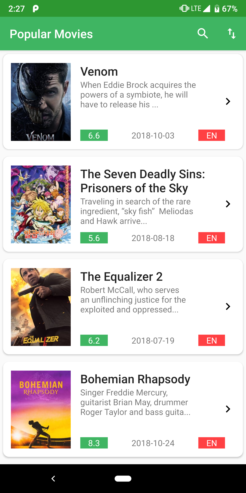
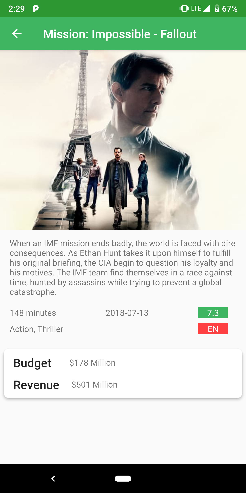
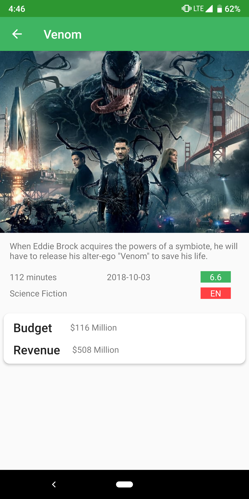

# MDB

  

## Requirement
- Using the free version of Tmdb movie API, make a simple movie app that has two screens - one to list the popular movies by descending order of popularity for which you’d need to hit /discover API end. The 2nd screen will be a movie detail screen which opens when a user clicks on a movie banner. For the detail, you will need to hit /movie/{movie_id} API end. Sign up on their developer platform and obtain an API key to use their API.  

## Features and Libraries Used
- OkHttp 
- Picasso 
- Anko 

**Screenshots** 

